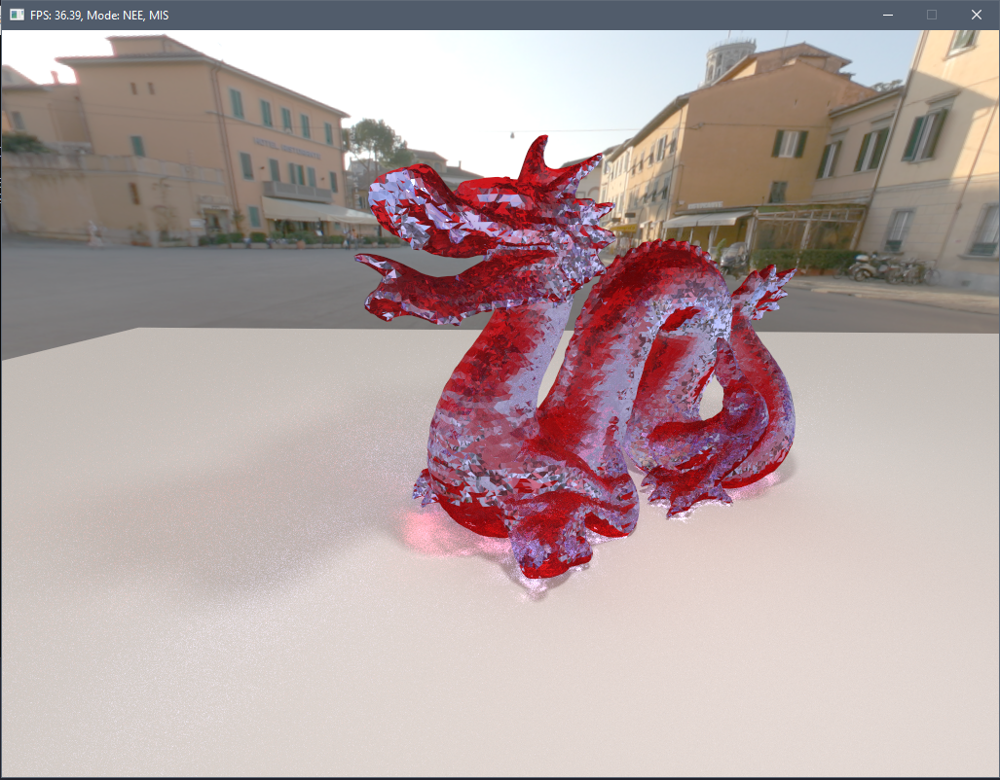

# Tracer

A real-time ray/path tracing application.

## Features

- Implements a cache-aligned BVH & 4-way MBVH with the following build methods: SAH, Binned SAH & Central split
- Dynamic objects with support for BVH-refitting and rebuilding (Only on CPU, for now...)
- Multithreaded CPU path/ray tracer & multithreaded BVH building
- Ray & path tracer on CPU
- OpenCL path tracer on GPU
- Sphere, plane, torus & triangles on CPU & triangles on GPU
- Variance reduction: Next Event Estimation & Multiple Importance Sampling
- Lambert Diffuse BRDF & Microfacet BRDF (GGX)

## Screenshots

## Building

Using CMake this project can be build on MacOS, Windows & Linux. All platforms have been successfully tested. For Linux Ubuntu 18.04 was used with a NVIDIA GTX 1080.

### Dependencies
- GLEW
- SDL2
- OpenCL
- GLM
- FreeImage

Libraries have been included for Windows and CMake is configured to automatically link to the libs included in this
repository. For Linux/Mac you should install GLEW, SDL2, FreeImage and (only on Linux) OpenCL libraries.

This project makes use of an OpenCL/OpenGL interop. Intel iGPUs do not support texture interop and therefor the OpenCL implementation in this project will not work on these GPUs.

## Controls

Switching between the m_Modes can be done using the following buttons:
- 1 for Reference (CPU + GPU)
- 2 for Next Event Estimation (NEE) (CPU)
- 3 for Importance Sampling (IS) (CPU)
- 4 for NEE + IS (CPU)
- 5 for NEE + Multiple IS (CPU + GPU)
- 6 for Reference + Microfacets (CPU + GPU)

The camera can be controlled using the mouse & WASD. View direction can also be changed using the arrow keys.
The camera can be locked/unlocked by pressing L.

## Planned features
- Play around with NVIDIA RTX (through OptiX)
- Port dynamic BVH to GPU
- More material types & improved microfacets
- Spatial BVH
- Implement Assimp model loader
